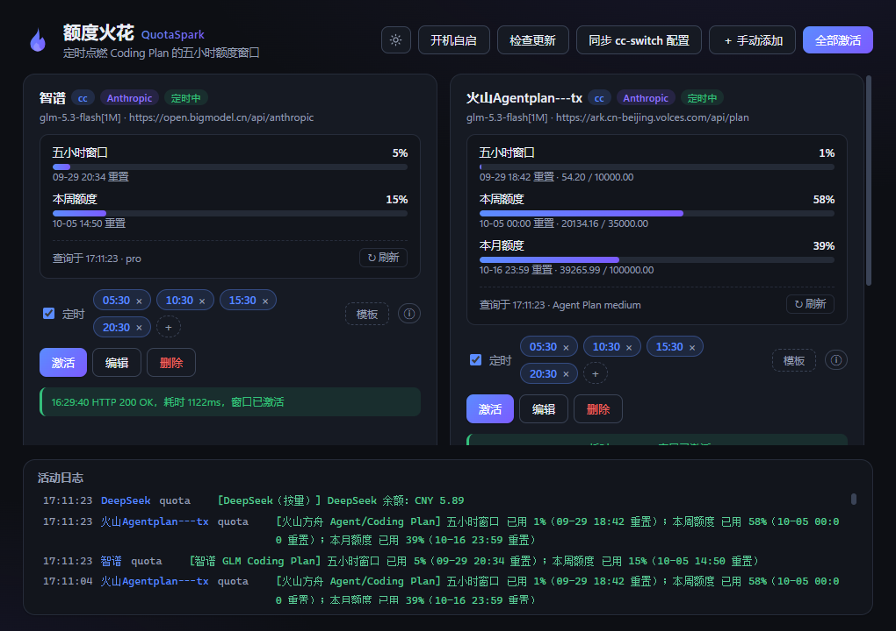

# 额度火花 QuotaSpark

一个 Windows 托盘小工具，用于**定时激活 Coding Plan / Token Plan 的五小时额度窗口**。

很多 Coding Plan（智谱 GLM、Kimi For Coding 等）的额度窗口从"第一次请求"开始计算，
滚动 5 小时后刷新。本工具在指定时刻向各供应商发送一条 `max_tokens=1` 的最小请求
（内容为 `"hi"`），把窗口"点火"到你想要的时间点——例如 05:30 / 10:30 / 15:30 / 20:30
四连发，窗口就会首尾相接、全天可用。

[](https://github.com/tuxin-labs/quotaspark/releases/latest)
[](LICENSE)




## 下载安装

从 [Releases](https://github.com/tuxin-labs/quotaspark/releases/latest) 下载
`QuotaSpark_x.y.z_x64-setup.exe` 双击安装（Windows 10+）。已安装的用户通过顶栏
「检查更新」一键升级。

## 快速上手

1. **导入供应商**：点「同步 cc-switch 配置」一键导入（需本机装有
   [cc-switch](https://github.com/farion1231/cc-switch) 并添加过供应商），
   或「＋ 手动添加」填 Base URL / API Key / 激活用模型
2. **设定时**：勾选卡片上的「定时」，添加触发时间，或点「模板」套用
   「全天接力」——时间点间隔设为 5 小时，窗口即可全天首尾相接
3. **查额度**：点「查额度」查看套餐窗口占用，「↻ 刷新」可重查；
   不支持查额度的供应商不显示查询入口，激活不受影响
4. **常驻运行**：开启顶栏「开机自启」；关闭窗口即隐藏到托盘，调度持续生效

## 功能

- **同步 cc-switch 配置**：一键读取 `~/.cc-switch/cc-switch.db`（只读），导入全部
  Claude 类供应商；cc-switch 里配置的额度查询凭据（火山 AK/SK、智谱团队
  组织/项目 ID、ZenMux 用量端点）一并带过来
- **手动添加供应商**：支持 Anthropic Messages 与 OpenAI Chat Completions 两种接口格式
- **定时激活**：每个供应商可设多个每日触发时间（HH:MM），可随时启停
- **多供应商并发激活**：卡片单独"激活"，或托盘 / 顶栏"全部激活"
- **额度查询（12 家，与 cc-switch 对齐）**：Kimi For Coding、智谱 GLM（个人版/团队版）、
  MiniMax、ZenMux、OpenCode Go、火山方舟 Agent/Coding Plan；余额类：DeepSeek、
  StepFun、SiliconFlow、OpenRouter、Novita AI
- **托盘常驻**：关闭窗口 = 隐藏到托盘，调度持续运行；托盘菜单可"立即全部激活"
- **小功能**：开机自启、深浅主题、调度说明、激活/查询审计日志

## 工作原理

- **激活**：向 `base_url + /v1/messages`（Anthropic 格式）或 `/v1/chat/completions`
  （OpenAI 格式）发送 `model + max_tokens=1` 的最小请求，HTTP 2xx 即视为窗口已点燃；
  模型名自动剥掉 cc-switch 的 `[1M]` 上下文标记后缀
- **调度**：每 30 秒检查一次触发时间；触发窗口为目标时刻起 10 分钟内（应用晚开
  也能补发），去重键持久化在配置里，重启不会重复发送
- **额度**：按 `base_url` 识别供应商并路由到对应端点；启动时预取一次支持的额度，
  激活成功后自动刷新

## 数据与安全

- 配置（含 API Key）只保存在本机 `~/.cc-activator/config.json`，原子写入，不上传
- 对 cc-switch 数据库**只读不写**，删除本工具不影响 cc-switch
- 应用为单实例：重复启动只唤起已有窗口，不会出现两份调度器争写同一配置
- 更新包经 Tauri updater 签名校验后才会安装
- 激活请求本身会计入套餐用量（一条 `hi`、1 个 token 的成本，可忽略不计）

> ⚠️ 部分厂商的服务条款对"自动化客户端"有约定，请自行评估；官方订阅
> （Claude/OpenAI 官方账号）建议不要用于此类自动化。

## 开发与测试

前置：Node.js ≥ 20.19（Vite 8 要求）、Rust stable（MSVC 工具链）、WebView2 运行时。

```bash
npm install
npm run tauri dev     # 开发调试
npm run tauri build   # 打包安装程序
```

- Rust 单测：`cd src-tauri && cargo test`
- 前端类型检查：`npx tsc --noEmit`
- 端到端（真实驱动 UI 的增删改查/调度/主题/更新入口）：应用以
  `WEBVIEW2_ADDITIONAL_BROWSER_ARGUMENTS="--remote-debugging-port=9222" npm run tauri dev`
  启动后执行 `npm run e2e`

技术栈：Tauri 2 · Rust · React 19 · TypeScript。

打版与签名发布流程见 [docs/RELEASING.md](docs/RELEASING.md)。

## 致谢

- [cc-switch](https://github.com/farion1231/cc-switch)（MIT）—— 额度查询的端点与解析逻辑移植自该项目

## 许可证

[MIT](LICENSE)
